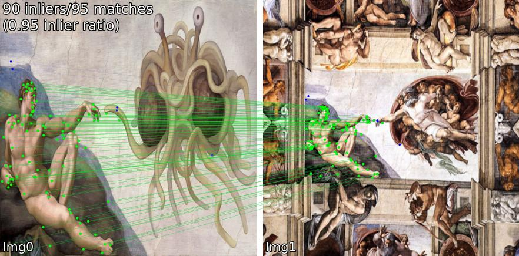
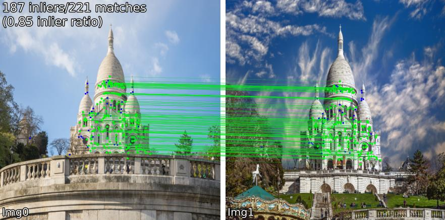

# SIFT + BF + DEGENSAC + USAC Feature Matching

This project implements a robust image matching system using feature detectors (like SIFT or ORB) and OpenCV’s advanced homography estimators: **DEGENSAC** and **USAC** , it also uses **LBP** and **HOG**.

## 📌 Features

- 🔍 Keypoint detection using SIFT/ORB
- 🧮 Feature matching with BFMatcher or FLANN
- 🧠 Robust homography estimation using:
  - RANSAC
  - LMEDS
  - USAC
  - DEGENSAC (degeneracy-aware RANSAC)
- 🖼️ Visual result showing matching and inliers

